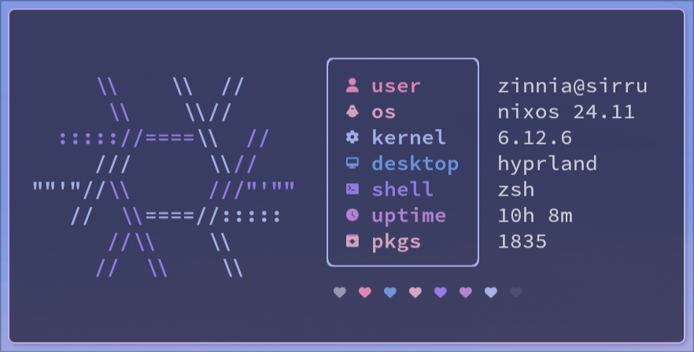

<div align="center">

# `fletchling`

A light and stylish fetcher written in [Nim](https://nim-lang.org)



</div>

# Introduction

`fletchling` is a system information fetcher that seeks to be fast and
light. While small, it's also customizable and gets the job done
with style.

It uses what Nim has to offer to its advantage:

- Small executable size
- Dependency-free
- Quick performance

> [!note]
> `fletchling` is in alpha and in heavy development.
> I regularly use it on NixOS, but it's not guaranteed to work
> on other systems yet.

# Why `fletchling`?

`fletchling` started as my first program in POSIX shell.
The language and syntax weren't quite the right tools for the job
as it grew in complexity, so I rewrote it to start learning Nim instead.

Hence, the portmanteau of "fetch" and "fledgling."

# Installation

## Nimble

_TODO_

## Nix Flake

Add `fletchling` to your flake inputs and overlays.

Then you can add it to your packages with `pkgs.fletchling`.

Example:

```nix
{
  inputs = {
    fletchling.url = "github:mimvoid/fletchling";
  };

  outputs = { self, nixpkgs, ... } @ inputs:
    let
      system = "your-system";
      pkgs = import nixpkgs {
        inherit system;
        overlays = [ inputs.fletchling.overlay ];
      };
    in
    {
      nixosConfigurations."your-hostname" = nixpkgs.lib.nixosSystem {
        inherit system pkgs;
        modules = [
          (
            { pkgs }:
            {
             environment.systemPackages = with pkgs; [ fletchling ];
            }
          )
        ];
      };
    };
}
```

---

# Special Thanks

I want to give my thanks to [nitch](https://github.com/ssleert/nitch) for
being my first introduction to Nim and a major inspiration for this project.

Other notable mentions:

- [disfetch](https://github.com/q60/disfetch), which inspired the previous POSIX shell version
- [diyfetch](https://github.com/info-mono/diyfetch)
- [fetchutils](https://github.com/kiedtl/fetchutils)
